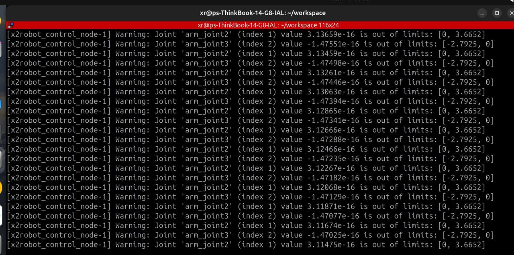

# X2Robot Robotic Arm SDK

X2Robot 6-DOF Robotic Arm SDK, providing ROS2 interfaces for development.

## ⚠️ Safety Precautions

> [!WARNING]

>
> 1. **Environment preparation before 6-axis arm operation**
>    - The 6-axis arm must be securely fixed to the table with screws to prevent detachment due to excessive movement speed; and
>    - Sufficient movement space must be left for the 6-axis arm, do not place unrelated items around the movement space,
>    - When starting to execute relevant control, relevant developers should keep a certain distance
>
> 2. **Do not start multiple ROS services in the same single-arm environment**
>    Running `ros2 launch zbl_arm_6a_description test_single_arm.launch.py &` will start the 6-axis arm related control services and run in docker background. After exec exits docker, this service will not exit. If ROS services are started in other docker at this time, due to receiving multiple control commands, the 6-axis arm will have abnormal vibration. In serious cases, it may damage the joint motors!!!
>
>    The safer operation method is: when not using this development environment to control the 6-axis arm, it is recommended to exec exit the development environment and execute `docker stop <container_name>` to close the development environment. Next use, execute `docker restart <container_name>`

## Directory Structure

```
sdk_arm_6a/
├── .devcontainer/           # VSCode/Cursor development container configuration
│   ├── devcontainer.json
│   ├── docker-compose.yml
│   ├── Dockerfile.base      # Base image: system + Python + ROS 2 (built once)
│   ├── Dockerfile           # Dev image: user + deps/ + lib/ (rebuilt per release)
│   ├── apt.list
│   ├── ros2_apt.list
│   └── pip.list
├── deps/                    # Dependencies
├── lib/                     # Libraries
├── examples/                # Example code
│   ├── python/              # Python examples
├── docs/                    # Documentation
├── README.md
└── README_en.md            # English documentation
```

## Quick Start

### Environment Requirements

- Linux system (Ubuntu 22.04 and above recommended), kernel version > 3.4, USB-to-CAN module
- Available memory > 2GB
- Available USB port, USB 2.0 and above

### Hardware Connection
Connect the USB-to-CAN module using a USB cable to connect PC and robotic arm.

### Build and Run SDK Development Container

#### Download Code
```bash
cd ~
git clone https://github.com/X-Square-Robot/sdk_arm_6a.git
cd sdk_arm_6a
```

### Start CAN Interface

Execute the following commands on Host:

```bash
sudo apt install can-utils
bash open_can0.sh # Script in the code directory
sudo ifconfig can0 txqueuelen 1000
```

If successful, you will see logs like:

```
Starting slcand...
Configuring can0 interface...
can0 started successfully
CAN interface can0 is working normally
```

#### Docker Installation
Refer to [Docker Official Documentation](https://docs.docker.com/engine/install/)

#### Docker Compose Installation
Refer to [Docker Compose Official Documentation](https://docs.docker.com/compose/install/)

#### Configure Docker Mirror Accelerator (Recommended for Chinese Users)

To speed up Docker image downloads (especially in mainland China), it is recommended to configure mirror accelerators.

> [!TIP]
> - Using multiple mirror sources can improve fault tolerance, Docker will automatically try the next one
> - If a mirror source fails, you can remove that address or replace it with other mirror sources
> - After configuring mirror acceleration, images like `ubuntu:24.04` will be automatically pulled from domestic mirror sources, greatly improving build speed.

Edit `/etc/docker/daemon.json` (create if it doesn't exist):

```bash
sudo mkdir -p /etc/docker
sudo vim /etc/docker/daemon.json
```
Add the following registry mirrors:
```bash
"registry-mirrors": [
  "https://docker.m.daocloud.io",
  "https://dockerproxy.com",
  "https://docker.mirrors.ustc.edu.cn",
  "https://docker.nju.edu.cn"
]
```

Restart Docker service to apply configuration:

```bash
sudo systemctl daemon-reload
sudo systemctl restart docker
```

Verification:

```bash
docker info | grep -A 5 "Registry Mirrors"
```

**Available mirror sources in China**:

| Mirror Source | Address | Description |
|---------------|---------|-------------|
| DaoCloud | `https://docker.m.daocloud.io` | Recommended, fast and stable |
| DockerProxy | `https://dockerproxy.com` | Community maintained, relatively fast |
| USTC | `https://docker.mirrors.ustc.edu.cn` | Good for education networks |
| NJU | `https://docker.nju.edu.cn` | Good for education networks |
| Alibaba Cloud | `https://<your_id>.mirror.aliyuncs.com` | Requires registration [Container Image Service](https://cr.console.aliyun.com/cn-hangzhou/instances/mirrors) to get personal acceleration address |

#### Build Image manually

The image is built in two layers to avoid re-running `apt-get update` (which can pull
new ROS 2 package versions whose ABI no longer matches the pre-compiled artifacts
under `deps/`) every time `deps/` changes:

| Image | Dockerfile | When to rebuild |
|---|---|---|
| `zbl_arm_6a_sdk:base_latest` | `.devcontainer/Dockerfile.base` | Only when `apt.list` / `ros2_apt.list` / `pip.list` / `Dockerfile.base` change (~10 min) |
| `zbl_arm_6a_sdk_image:v0.1.0` | `.devcontainer/Dockerfile` | Every time `deps/` or `lib/` is updated (~30 s) |

```bash
cd ~/sdk_arm_6a

# First time on this machine: build the base image (~10 min, only needed once)
docker build -f .devcontainer/Dockerfile.base -t zbl_arm_6a_sdk:base_latest .

# Day-to-day: rebuild dev image on top of existing base (~30 s)
cd .devcontainer
docker compose build
docker compose up -d
```

Expected output:
```bash
[+] Building 1/1
 ✔ zbl_arm_6a_sdk_image:v0.1.0  Built
 +] Running 1/1
 ✔ Container zbl_arm_6a_sdk  Started
```

> [!NOTE]
> Only rebuild the base image when `apt.list` / `ros2_apt.list` / `pip.list` /
> `Dockerfile.base` change.
>
> ROS 2 packages installed into the base image are pinned to a snapshot of
> [`snapshots.ros.org`](http://snapshots.ros.org/jazzy/) (see `ROS2_SNAPSHOT_DATE`
> at the top of `Dockerfile.base`). This guarantees that every rebuild of the base
> image installs the **exact same** ROS 2 package versions, so the binaries shipped
> in `deps/` stay ABI-compatible with the runtime in the container. To upgrade,
> bump `ROS2_SNAPSHOT_DATE` to a newer date listed at the snapshot index.
>
> `snapshots.ros.org` is hosted by OSRF; downloads can be slower than the Tsinghua
> mirror but the URL is fixed by design and reaches users worldwide.

> [!IMPORTANT]
> **ABI compatibility check.** The dev image build (`docker compose build`) compares
> `deps/SNAPSHOT_DATE` (stamped by the arm_sdk CI that compiled `deps/`) against
> `/opt/xr/BASE_SNAPSHOT_DATE` (stamped into the base image by `Dockerfile.base`).
> If the two snapshot dates differ, the build fails with explicit instructions —
> this catches the case where you bump `ROS2_SNAPSHOT_DATE` in `Dockerfile.base`
> but forget to pull a new `deps/` release built against the same snapshot. If
> either file is missing (older `deps/` predating this check), the build only
> prints a warning and continues.

#### Automatically build image using VS Code Dev Container (Optional)

1. Install [VSCode](https://code.visualstudio.com/)
2. Install VSCode plugin: [Dev Containers](https://marketplace.visualstudio.com/items?itemName=ms-vscode-remote.remote-containers)
3. Open the project folder in VSCode
4. Press `F1` and enter `Dev Containers: Reopen in Container`
5. Wait for container build to complete, first build may take longer

After startup, you can check the running SDK Docker container on the host terminal
```bash
docker ps | grep zbl_arm_6a_sdk
```

> [!NOTE] Note: If the container is already started via `docker compose up -d` command, step 4 above will fail. You need to execute `docker compose down` in the ~/sdk_arm_6a/.devcontainer directory first, then execute it again.

#### SDK Controller Process Startup

Enter the container:

```bash
docker exec -it zbl_arm_6a_sdk bash
```

Execute in container:

```bash
ros2 launch zbl_arm_6a_description test_single_arm.launch.py &
```

> [!NOTE]
> ROS_DOMAIN_ID defaults to 134. If you need to modify it, set environment variables before running the above command, or modify the `Dockerfile` settings and rebuild the dev image.

Execute in container:

```bash
ros2 launch zbl_arm_6a_description test_single_arm.launch.py &
```


> [!NOTE]
> ROS_DOMAIN_ID defaults to 134. If you need to modify it, set environment variables before running the above command, or modify the `Dockerfile` settings and rebuild the dev image.


## Run Examples
Execute in container
```bash
cd ~/workspace/examples/python/
python3 01_state_monitor.py
# Press Ctrl + C to stop the program
```
See example code section for other examples

### Docker Installation
Refer to [Docker Official Documentation](https://docs.docker.com/engine/install/)

### Docker Compose Installation
Refer to [Docker Compose Official Documentation](https://docs.docker.com/compose/install/)

### Configure Docker Mirror Accelerator (Recommended)

To speed up Docker image downloads (especially in mainland China), it is recommended to configure mirror accelerators.

Edit `/etc/docker/daemon.json` (create if it doesn't exist):

```bash
sudo mkdir -p /etc/docker
sudo vim /etc/docker/daemon.json
```
Add the following registry mirrors:

```json
{
  "registry-mirrors": [
    "https://docker.m.daocloud.io",
    "https://dockerproxy.com",
    "https://docker.mirrors.ustc.edu.cn",
    "https://docker.nju.edu.cn"
  ]
}
```

**Available mirror sources in China**:

| Mirror Source | Address | Description |
|---------------|---------|-------------|
| DaoCloud | `https://docker.m.daocloud.io` | Recommended, fast and stable |
| DockerProxy | `https://dockerproxy.com` | Community maintained, relatively fast |
| USTC | `https://docker.mirrors.ustc.edu.cn` | Good for education networks |
| NJU | `https://docker.nju.edu.cn` | Good for education networks |
| Alibaba Cloud | `https://<your_id>.mirror.aliyuncs.com` | Requires registration for personal address |

> [!TIP]
> - Using multiple mirror sources can improve fault tolerance, Docker will automatically try the next one
> - Alibaba Cloud mirror requires account registration at [Container Image Service](https://cr.console.aliyun.com/cn-hangzhou/instances/mirrors) to get the personal acceleration address
> - If a mirror source fails, you can remove that address or replace it with other mirror sources

Restart Docker service to apply configuration:

```bash
sudo systemctl daemon-reload
sudo systemctl restart docker
```

Verification:

```bash
docker info | grep -A 5 "Registry Mirrors"
```

> [!NOTE]
> After configuring mirror acceleration, images like `ubuntu:24.04` will be automatically pulled from domestic mirror sources, greatly improving build speed.

### Install VSCode and Dev Container

Dev Container is a VSCode plugin that allows convenient development in containers. Users can install it as needed.

1. Install [VSCode](https://code.visualstudio.com/)
2. Install VSCode plugin: [Dev Containers](https://marketplace.visualstudio.com/items?itemName=ms-vscode-remote.remote-containers)
3. Open the project folder in VSCode
4. Press `F1` and enter `Dev Containers: Reopen in Container`
5. Wait for container build to complete

## CAN Interface Startup

Execute the following script:

```bash
sudo apt install can-utils
bash open_can0.sh
sudo ifconfig can0 txqueuelen 1000
```

If successful, you will see logs like:

```
Starting slcand...
Configuring can0 interface...
can0 started successfully
```

## SDK Controller Process Startup

Enter the container:

```bash
docker exec -it zbl_arm_6a_sdk bash
```

Execute in container:

```bash
ros2 launch zbl_arm_6a_description test_single_arm.launch.py &
```

> [!NOTE]
> ROS_DOMAIN_ID defaults to 134. If you need to modify it, set environment variables before running the above command, or modify the `Dockerfile` settings and rebuild the dev image.

## API Reference Documentation

Detailed ROS 2 interface documentation please refer to:

- **[English API Documentation](docs/API_en.md)**

Documentation includes the following content:
- Status interfaces (joint states, end poses, diagnostic information, camera data, etc.)
- Control interfaces (joint position control, task space control, zero force dragging, gripper control, etc.)

## Example Code

- **[Python Example Code](examples/python)**

## FAQ

**Q1: No module named 'rclpy'**
When executing example code, error appears as shown:

**A:**
The current environment variables are not set, please execute the following commands:
```bash
source /opt/xr/core/install/setup.bash
export LD_LIBRARY_PATH=${LD_LIBRARY_PATH}:/usr/local/lib
```

**Q2: Connection timeout, during operation of controlling 6-axis arm, joint connection timeout suddenly appears**

**A:**
Generally consider cable loosening, reconnect to resolve.
Steps:
Disconnect wired connection, reconnect wired connection, rerun after detecting CAN0 normal, enter docker, ros launch in docker.

**Q3: No buffer space available**
If the following error appears when running ros2 launch command:

**A:**
This error indicates that the CAN bus buffer is full and cannot send more data. This is a common resource limitation issue in CAN communication.

Step 1: First let the current ros2 launch exit
Check the current buffer size setting of can0 outside the container:
```bash
# Execute the following command
ifconfig
can0: flags=193<UP,RUNNING,NOARP>  mtu 16
        unspec 00-00-00-00-00-00-00-00-00-00-00-00-00-00-00-00  txqueuelen 10  (UNSPEC)
        RX packets 1006075  bytes 8048600 (8.0 MB)
        RX errors 0  dropped 0  overruns 0  frame 0
        TX packets 1006078  bytes 8048624 (8.0 MB)
        TX errors 0  dropped 0 overruns 0  carrier 0  collisions 0

# Increase buffer size (critical step)
sudo ip link set can0 txqueuelen 1000  # Default is usually 10
```

After setting successfully, return to container and execute ros2 launch command again.

**Q4: Joint warning: out of limit**
As shown below, in task space pose control mode, controlling 6-axis arm back to zero may trigger out of limit warning.


**A:**
This is because there may be some errors between end control back to zero position coordinates and pose. Generally does not affect use and can be ignored. To avoid triggering this warning when controlling back to zero, set some margin as shown in code block:
```python
target_pose = Pose()
target_pose.position = Point(x=0.0, y=0.0, z=0.01)
target_pose.orientation = Quaternion(x=0.0, y=0.0, z=0.0, w=1.0)
```

**Q5: Control process startup error**

If executing `ros2 launch zbl_arm_6a_description test_single_arm.launch.py &` fails, it may be that the hardware environment is not initialized yet. Please execute again.

## Contribution

Welcome to submit Issues and Pull Requests!

## License

[To be determined]

## Contact Information

- Project homepage: [GitHub](https://github.com/X-Square-Robot/sdk_arm_6a.git)
- Documentation: View `docs/` directory
