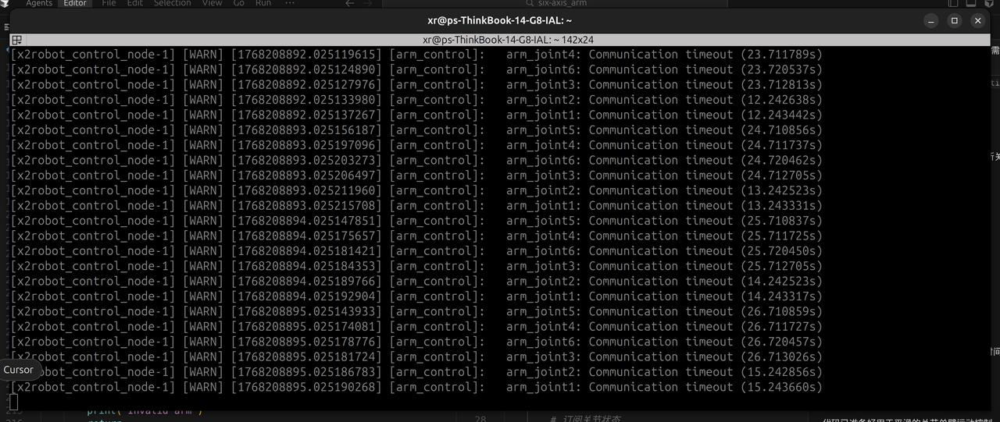
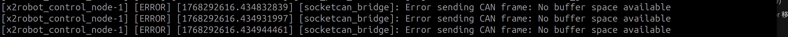

# 自变量六轴机械臂SDK

自变量六轴机械臂SDK，提供ROS2接口用于二次开发。

## ⚠️ 安全注意事项

> [!WARNING]
>
> 1. **六轴臂运行前的环境准备**
>    - 务必将六轴臂用螺丝固定好在桌面上，避免运动速度过快脱离桌面；且
>    - 需要留给六轴臂一定的运动空间，运动空间周围不要放置和控制无关的物品，
>    - 开始执行相关控制，请相关开发人员保持一定的距离
>
> 2. **！请勿起在同一个单臂环境中拉起多个ros服务**
>    运行`ros2 launch zbl_arm_6a_description test_single_arm.launch.py &`会把六轴臂的相关控制服务拉起，且运行在docker后台，exec退出docker后该服务并不会退出，如果此时再在其他docker中拉起ros服务，由于收到多个控制指令，六轴臂会出现异常抖动，严重情况下，可能会损坏关节电机！！！
>    比较保险的操作方式是，不使用该开发环境控制六轴臂时，建议exec退出开发环境后，执行docker stop <容器名>，关闭开发环境，下次使用，执行docker restart <容器名>

## 目录结构

```
sdk_arm_6a/
├── .devcontainer/           # VSCode/Cursor 开发容器配置
│   ├── devcontainer.json
│   ├── docker-compose.yml
│   ├── Dockerfile.devcontainer
│   ├── apt.list
│   ├── ros2_apt.list
│   └── pip.list
├── deps/                    # 依赖
├── lib/                     # 库文件
├── examples/                # 示例代码
│   ├── python/              # Python示例代码
├── docs/                    # 文档
├── README.md
└── README_en.md            # 英文版文档
```

## 快速开始

### 环境要求

- linux系统(推荐Ubuntu 22.04及以上)，内核版本大于 3.4，USB转CAN模块
- 可用内存大于 2GB
- 有可用 USB 接口，USB2.0 及以上

### 硬件连接
使用USB线连接USB转CAN模块，将PC和机械臂连接

### 构建和运行SDK开发容器

#### 下载代码
```bash
cd ~
git clone https://github.com/X-Square-Robot/sdk_arm_6a.git
cd sdk_arm_6a
```

### 启动CAN接口

在Host上执行下面的命令：

```bash
sudo apt install can-utils
bash open_can0.sh # 代码目录中的脚本
sudo ifconfig can0 txqueuelen 1000
```

如果运行成功，则会显示下面的日志：

```
Starting slcand...
Configuring can0 interface...
can0 started successfully
CAN interface can0 is working normally
```

#### Docker安装
  参考 [Docker 官方文档](https://docs.docker.com/engine/install/)
#### Docker Compose安装
  参考 [Docker Compose 官方文档](https://docs.docker.com/compose/install/)

#### 配置 Docker 镜像加速器（国内用户推荐配置）

为了加快 Docker 镜像拉取速度（特别是在中国大陆），建议配置镜像加速器。
> [!TIP]
> - 配置多个镜像源可以提高容错性，Docker 会自动尝试下一个
> - 如果某个镜像源失效，可以移除该地址或更换其他镜像源
> - 配置镜像加速后，`ubuntu:24.04` 等镜像会自动从国内镜像源拉取，大幅提升构建速度。


编辑 `/etc/docker/daemon.json`（如果文件不存在则创建）：

```bash
sudo mkdir -p /etc/docker
sudo vim /etc/docker/daemon.json
```
添加以下镜像registry
```bash
"registry-mirrors": [
    "https://docker.m.daocloud.io",
    "https://dockerproxy.com",
    "https://docker.mirrors.ustc.edu.cn",
    "https://docker.nju.edu.cn"
  ]
```

重启 Docker 服务使配置生效：

```bash
sudo systemctl daemon-reload
sudo systemctl restart docker
```

验证配置：

```bash
docker info | grep -A 5 "Registry Mirrors"
```

**国内可用的镜像源**：

| 镜像源 | 地址 | 说明 |
|--------|------|------|
| DaoCloud | `https://docker.m.daocloud.io` | 推荐，速度快且稳定 |
| DockerProxy | `https://dockerproxy.com` | 社区维护，速度较快 |
| 中科大 | `https://docker.mirrors.ustc.edu.cn` | 教育网友好 |
| 南京大学 | `https://docker.nju.edu.cn` | 教育网友好 |
| 阿里云 | `https://<your_id>.mirror.aliyuncs.com` | 需要注册[容器镜像服务](https://cr.console.aliyun.com/cn-hangzhou/instances/mirrors)获取专属加速地址 |


#### 手动构建镜像
```bash
cd ~/sdk_arm_6a/.devcontainer
docker compose build
docker compose up -d
```

预期输出:
```bash
[+] Building 1/1
 ✔ zbl_arm_6a_sdk_image:v0.1.0  Built 
 +] Running 1/1
 ✔ Container zbl_arm_6a_sdk  Started 
```

#### 通过VSCode和Dev Container自动构建(可选)

1. 安装 [VSCode](https://code.visualstudio.com/)
2. 安装 VSCode 插件: [Dev Containers](https://marketplace.visualstudio.com/items?itemName=ms-vscode-remote.remote-containers)
3. 在 VSCode 中打开项目文件夹
4. 按 `F1` 输入 `Dev Containers: Reopen in Container`
5. 等待容器构建完成, 第一次构建可能需要较长时间

启动之后就可以在host的终端查看sdk运行的docker:
```bash 
docker ps | grep zbl_arm_6a_sdk
```

> [!NOTE] 注意: 如果已经通过```docker compose up -d```命令启动了容器, 上面第4步骤会执行失败, 需要先在~/sdk_arm_6a/.devcontainer目录下执行```docker compose down```之后再执行

#### SDK控制器进程启动

进入容器：

```bash
docker exec -it zbl_arm_6a_sdk bash
```

在容器内执行：

```bash
ros2 launch zbl_arm_6a_description test_single_arm.launch.py &
```

> [!NOTE]
> ROS_DOMAIN_ID 默认为 134。如需修改，可在运行上述命令前通过设置环境变量修改，或修改 Dockerfile.devcontainer 配置后重新构建镜像。


### 运行示例
容器内执行
```bash
cd ~/workspace/examples/python/
python3  01_state_monitor.py
# 按 Ctrl + C 停止该程序
```
其他示例请参考示例代码章节


## API 参考文档

详细的 ROS 2 接口说明请参考：

- **[中文 API 文档](docs/API.md)**

文档包含以下内容：
- 状态接口（关节状态、末端位姿、诊断信息、相机数据等）
- 控制接口（关节位置控制、任务空间控制、零力拖动、夹爪控制等）


## 示例代码

- **[Python示例代码](examples/python)**

## FAQ

**Q1: No module named 'rclpy'**
在执行示例代码时会出现如图所示报错：

**A：**
当前环境变量没设置，请执行以下命令：
```bash
source /opt/xr/core/install/setup.bash
export LD_LIBRARY_PATH=${LD_LIBRARY_PATH}:/usr/local/lib
```

**Q2: 连接超时，操作控制六轴臂的过程中会突然出现如下图所示的关节连接超时的情况**

**A:**
一般考虑是连接线出现松动，重新连接即可
步骤如下：
断掉有线连接，重新接入有线连接，重新运行检测到CAN0正常后，进入docker，在docker中ros launch


**Q3: No buffer space available**
在运行ros2 launch命令的过程中如果出现下图的报错


**A:**
这个错误表示CAN总线的缓冲区已满，无法发送更多数据，是CAN通信中常见的资源限制问题

步骤1： 先让当前的ros2 launch  退
在容器外查看当前can0的当前设置的缓冲区大小
```bash
# 执行以下命令
ifconfig
can0: flags=193<UP,RUNNING,NOARP>  mtu 16
        unspec 00-00-00-00-00-00-00-00-00-00-00-00-00-00-00-00  txqueuelen 10  (UNSPEC)
        RX packets 1006075  bytes 8048600 (8.0 MB)
        RX errors 0  dropped 0  overruns 0  frame 0
        TX packets 1006078  bytes 8048624 (8.0 MB)
        TX errors 0  dropped 0 overruns 0  carrier 0  collisions 0

# 增加缓冲区大小（关键步骤）
sudo ip link set can0 txqueuelen 1000  # 默认通常是10
```

设置成功后，重新回到容器中执行ros2 launch的命令

**Q4: Joint warning : out of limit**
如下图所示，任务空间位姿控制模式下 控六轴臂回零会出现超限的警告，


**A:**
这是由于末端控制回零位的坐标和位姿会存在一些误差，一般不影响使用，可以忽略，控回零位可设置一些余留则可以避免触发这个warning， 如下代码块所示：
```python
target_pose = Pose()
target_pose.position = Point(x=0.0, y=0.0, z=0.01)
target_pose.orientation = Quaternion(x=0.0, y=0.0, z=0.0, w=1.0)
```

**Q5: 控制进程启动出错**

如果执行 ```ros2 launch zbl_arm_6a_description test_single_arm.launch.py &``` 出错, 可能是硬件环境还未初始化完成, 请重新执行

## 贡献

欢迎提交 Issue 和 Pull Request!

## 许可证

[待定]

## 联系方式

- 项目主页: [GitHub](https://github.com/X-Square-Robot/sdk_arm_6a.git)
- 文档: 查看 `docs/` 目录
